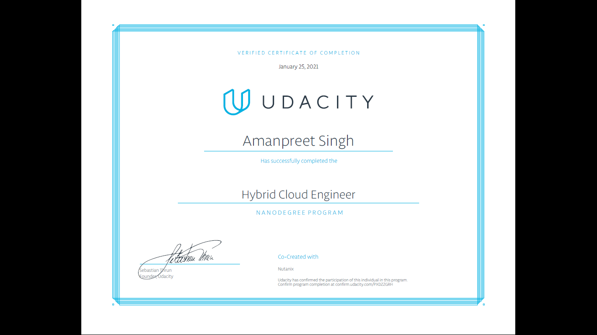

# Hybrid Cloud Engineer Nanodegree (HCEND), Udacity

> I was one of the 500 HCEND recipients chosen from the 5000 participants in the _"Nutanix Hybrid Cloud Scholarship Program"_. This repo contains a collection of project deliverables from my HCEND course work.

## Project Deliverables Summary
### 1. Private Cloud Web Application Infrastructure
* Build a Hyperconverged private cloud solution for evaluating a three-tier a web application on a Nutanix HCI cluster. The web application should have a web server VM, application VM and database server VM and run in separate production and development environments. 
* The production environment requires built-in data protection using backup/restore with snapshots and no more than 1 hour of data loss after a failure. Additional tests include VM workload expansion (cloning), the ability to dynamically add CPU/Memory resources to online virtual machines (add 1 vCPU and 2GB memory to the database server). Final verification is the removal of a key VM and performing a full restoration.
* The configuration tasks performed on Prism Element are as shown in the screenshots below:
* Infrastructure specification: refer to this [Project 1 Rubric](https://github.com/amanpreetsingh459/Hybrid-Cloud-Engineer-Nanodegree/blob/main/Project1_private%20cloud%20web%20application%20infrastructure/project1_rubric.pdf) 

### 2. Private Cloud SaaS Three-Tier Web Application
* Design a blueprint to deploy and configure a three-tier web application with a load balancer, web server and database VM hosted on the private cloud
* Insure each VM in configured with the proper resources and tasks.
* Test the deployment works with a read and write to the database.
* Test web tier scaling: scale-in and scale-out actions changing the population by a count of 1.
* Allow an end user to make a database backup.
* Infrastructure specification: refer to this [Project 2 Rubric](https://github.com/amanpreetsingh459/Hybrid-Cloud-Engineer-Nanodegree/blob/main/Project2_Private%20Cloud%20SaaS_3Tier%20Web%20App/project2_rubric.pdf) 

### 3. Hybrid Cloud SaaS Three-Tier Web Application
* Design a blueprint to deploy and configure a three tier web application with a load balancer hosted on the private cloud, two web server tiers (each hosted on a private and a public cloud)
* Insure each VM in configured with the proper resources and tasks
* Test the deployment works with a read and write to the database.
* Test web tier scaling: scale-in and scale-out actions changing the population by a count of 1 on private cloud separately from scaling on the public cloud.
* Allow self-service, ad-hoc backup of the database.
* Create two application profiles for deployment for a small (1 vCPU, 1 core, 1GB RAM or t2.micro) and medium (2vCPU, 2 cores, 1GB RAM or t2.micro) CPU and memory configuration variants.
* Infrastructure specification: refer to this [Project 3 Rubric](https://github.com/amanpreetsingh459/Hybrid-Cloud-Engineer-Nanodegree/blob/main/Project3_Hybrid%20Cloud%20SaaS_3Tier%20Web%20App/project3_rubric.pdf) 

